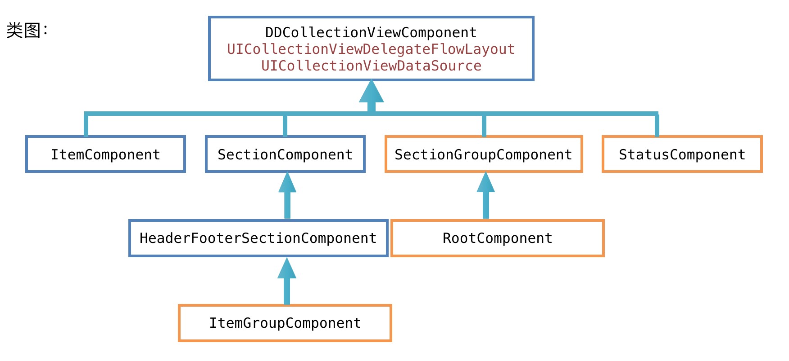
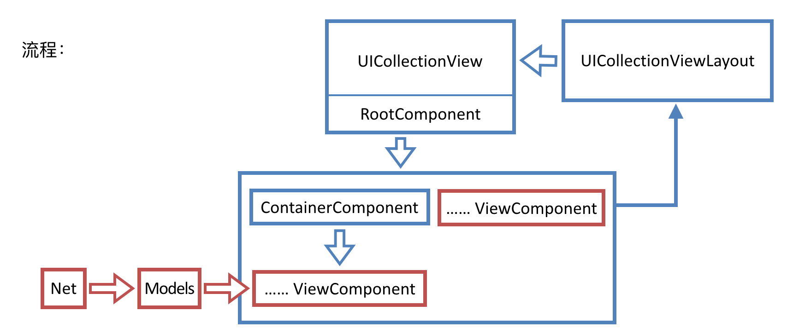

# DDComponent
Make a collection controller to several components. A `UICollectionView/UITableView` framework for building fast and flexible lists. Like `IGList`.

[中文文档](./README-zh.md)

# Requirements

* Xcode 8.0+
* iOS 8.0+

# Installation

### CocoaPods

```
pod 'DDComponent'
```

### Carthage

```
github 'DDComponent'
```

# Getting Started

For easy using, the api is similar to `UICollectionView` and `UITableView`.


```objc
@interface YourComponent : DDCollectionViewSectionComponent
@end

@implementation

- (instancetype)init
{
    self = [super init];
    if (self) {
        self.size = CGSizeMake(DDComponentAutomaticDimension, 44);
        // config here. 
        // Remember self.collectionView is nil until it is added to root component.
    }
    return self;
}

- (void)prepareCollectionView {
    [super prepareCollectionView];
    // register your cell here.
}

- (NSInteger)numberOfSectionsInCollectionView:(UICollectionView *)collectionView {
    return 1;
}

- (NSInteger)collectionView:(UICollectionView *)collectionView numberOfItemsInSection:(NSInteger)section {
    return 1;
}

- (CGSize)collectionView:(UICollectionView *)collectionView layout:(UICollectionViewLayout *)collectionViewLayout sizeForItemAtIndexPath:(NSIndexPath *)indexPath {
    return ... // Return your cell
}

@end
```

And the other api is also the same.

```objc
- (void)collectionView:(UICollectionView *)collectionView didSelectItemAtIndexPath:(NSIndexPath *)indexPath {
    // select item
}
- (void)collectionView:(UICollectionView *)collectionView willDisplayCell:(UICollectionViewCell *)cell forItemAtIndexPath:(NSIndexPath *)indexPath {
    // will display
}
```

# Structure



1. View Component: displaying. for example, a list of cell or just an element。
2. Container Component: combine the view components. For example, conbine some components as a list, or switch between different components(Loading, Error, Empty). And the root component is also a containter component.



We need to do is only the red part.

# Attension

Use `size`, `inset` first, then override the `delegate` api.

# Some Question

As use the system api, `indexPath` is the `UICollectionView`'s location. It is not the index of component's dataSource.